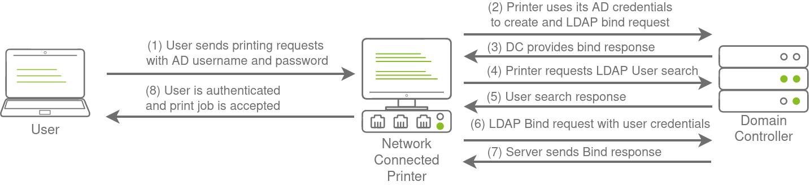
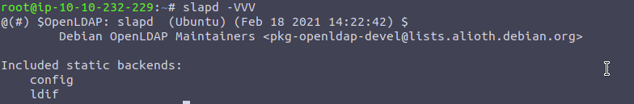
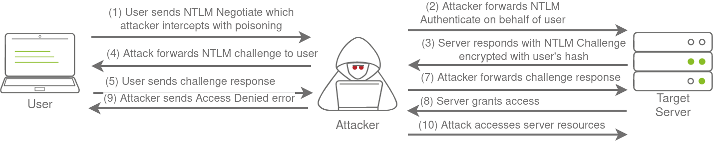

# Breaching AD 

these are my notes for the THM Breaching AD room

[https://tryhackme.com/room/breachingad](https://tryhackme.com/room/breachingad)

## Learning Objectives

In this network, we will cover several methods that can be used to breach AD. This is by no means a complete list as new methods and techniques are discovered every day. However, we will  cover the following techniques to recover AD credentials in this network:

- NTLM Authenticated Services
- LDAP Bind Credentials
- Authentication Relays
- Microsoft Deployment Toolkit
- Configuration Files

**don't forget to enable the breaching_ad ovpn file or download if from the networks tab on the access page from tryhackme**


## NTLM Authentication Services
NetNTLM typically uses with Non 3rd party systems like OWA RDP, or even VPN endpoints interagrated with AD and web applications
NTLM passes a challenge-resposne to AD to authenticate the user thus it never has your credentials only the AD controller does


LDAP popular with 3rd party applications that use AD
- Gitlab
- Jenkins
- Custom Web Apps
- printers
- VPNs

## LDAP Bind Credentials
LDAP has its own set of AD Credentials it uses to authenticate directly and verify your creds are vaild. this gives you new attack vectors (you could get the applicatons username and password :) )



"These credentials are often stored in plain text in configuration files since the security model relies on keeping the location and storage configuration file secure rather than its contents."

you can create your own rouge ldap server using slapd and ldap-utils

*tryhackme attackbox is running - slapd/bionic-updates,bionic-security 2.4.45+dfsg-1ubuntu1.11 amd64 [upgradable from: 2.4.45+dfsg-1ubuntu1.10]
  OpenLDAP server (slapd)*



ldap passback creds
- za.tryhackme.com\svcLDAP
- tryhackmeldappass1@

## Authentication Relays


using responder i get the following ouput from the network

```
[SMB] NTLMv2-SSP Client   : ::ffff:10.200.54.202
[SMB] NTLMv2-SSP Username : ZA\svcFileCopy
[SMB] NTLMv2-SSP Hash     : svcFileCopy::ZA:427747e7efd9ec63:AD0F979332E9962D2B6EA43F62C6F2DA:01010000000000000041A097C77BD801D8D3C0F4B7257AA20000000002000800580031004500440001001E00570049004E002D0042005500340054004E0059004400370045004300410004003400570049004E002D0042005500340054004E005900440037004500430041002E0058003100450044002E004C004F00430041004C000300140058003100450044002E004C004F00430041004C000500140058003100450044002E004C004F00430041004C00070008000041A097C77BD80106000400020000000800300030000000000000000000000000200000A6E46EC68C6A06D296F8D7503257D08414883F25CD8BF6A99C38120031609DD80A0010000000000000000000000000000000000009001E0063006900660073002F00310030002E00350030002E00350032002E0035000000000000000000
```
