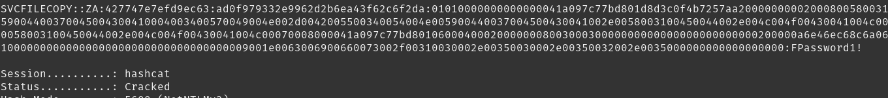
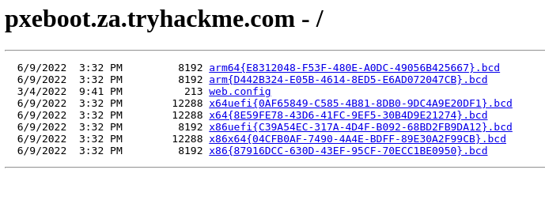
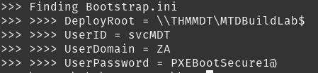

# Breaching AD 

these are my notes for the THM Breaching AD room

[https://tryhackme.com/room/breachingad](https://tryhackme.com/room/breachingad)

## Learning Objectives

In this network, we will cover several methods that can be used to breach AD. This is by no means a complete list as new methods and techniques are discovered every day. However, we will  cover the following techniques to recover AD credentials in this network:

- NTLM Authenticated Services
- LDAP Bind Credentials
- Authentication Relays
- Microsoft Deployment Toolkit
- Configuration Files

**don't forget to enable the breaching_ad ovpn file or download if from the networks tab on the access page from tryhackme**


## NTLM Authentication Services
NetNTLM typically uses with Non 3rd party systems like OWA RDP, or even VPN endpoints interagrated with AD and web applications
NTLM passes a challenge-resposne to AD to authenticate the user thus it never has your credentials only the AD controller does


LDAP popular with 3rd party applications that use AD
- Gitlab
- Jenkins
- Custom Web Apps
- printers
- VPNs

## LDAP Bind Credentials
LDAP has its own set of AD Credentials it uses to authenticate directly and verify your creds are vaild. this gives you new attack vectors (you could get the applicatons username and password :) )


"These credentials are often stored in plain text in configuration files since the security model relies on keeping the location and storage configuration file secure rather than its contents."

you can create your own rouge ldap server using slapd and ldap-utils

*tryhackme attackbox is running - slapd/bionic-updates,bionic-security 2.4.45+dfsg-1ubuntu1.11 amd64 [upgradable from: 2.4.45+dfsg-1ubuntu1.10]
  OpenLDAP server (slapd)*


ldap passback creds
- za.tryhackme.com\svcLDAP
- tryhackmeldappass1@

## Authentication Relays


using responder i get the following ouput from the network

```
[SMB] NTLMv2-SSP Client   : ::ffff:10.200.54.202
[SMB] NTLMv2-SSP Username : ZA\svcFileCopy
[SMB] NTLMv2-SSP Hash     : svcFileCopy::ZA:427747e7efd9ec63:AD0F979332E9962D2B6EA43F62C6F2DA:01010000000000000041A097C77BD801D8D3C0F4B7257AA20000000002000800580031004500440001001E00570049004E002D0042005500340054004E0059004400370045004300410004003400570049004E002D0042005500340054004E005900440037004500430041002E0058003100450044002E004C004F00430041004C000300140058003100450044002E004C004F00430041004C000500140058003100450044002E004C004F00430041004C00070008000041A097C77BD80106000400020000000800300030000000000000000000000000200000A6E46EC68C6A06D296F8D7503257D08414883F25CD8BF6A99C38120031609DD80A0010000000000000000000000000000000000009001E0063006900660073002F00310030002E00350030002E00350032002E0035000000000000000000
```

Now that we have the NTLMv2-SSP hash we can use hashcat and the passwordlist provided to crack it

```
hashcat -m 5600 <hash file> <password file> --force
```

hashtype 5600 is the NTLMv2-SSP hash within hashcat



- svcFileCopy
- FPassword1!

## Microsoft Deployment Toolkit

### Microsoft System Center Configuration Manager (SCCM) 
 - MDT assist with automation in deploying Windows
 - MDT is integrated into SCCM
 - MDT is used for new deployments
 - SCCM manages updates for Microsoft applications, services and windows os updates.
 - Allows for patch managment and sandboxed testing before rolling out domain wide.

### PXE Boot


 - Pre execution enviroment
 - allows devices to connect to the network and install images (os install) over the network
 - uses TFTP

 exploiting a pxe image happens for two reasons
  - inital priv esc vector  (gaining access to local admin account for control from boot)
  - performing password scraping attack to gain access to AD creds used during the install (this task focuses on that)

### PXE Boot Image Retrieval
- when using pxe the dhcp server will give you the ip of the MDT server when requesting an ip address (pxeboot.za.tryhackme.com in this network)
- you will also get back a list of names for the .bcd files
- bcd files store information pertaining to the pxe boots for different architecture types.



```
x64{5A9A0409-4BCF-4484-A3F5-7673FBB0750E}.bcd
```

```
>>>> Identify wim file : \Boot\x64\Images\LiteTouchPE_x64.wim 
\Boot\x64\Images\LiteTouchPE_x64.wim
```
Now that we have the image we can use the Get-FindCredentials function of powerpxe to extract them

```
Get-FindCredentials -WimFile pxeboot.wim
```



```
>>>> Finding Bootstrap.ini 
>>>> >>>> DeployRoot = \\THMMDT\MTDBuildLab$ 
>>>> >>>> UserID = svcMDT 
>>>> >>>> UserDomain = ZA
>>>> >>>> UserPassword = PXEBootSecure1@

```

## Configuration Files
- domain: za.tryhackme.com
- user: svcAV
- password_encrypted: jWbTyS7BL1Hj7PkO5Di/QhhYmcGj5cOoZ2OkDTrFXsR/abAFPM9B3Q==
- Decrypted password : MyStrongPassword!


## Mitigations

In terms of mitigations, there are some steps that organisations can take:

- User awareness and training - The weakest link in the cybersecurity chain is almost always users. Training users and making them aware that they should be careful about disclosing sensitive information such as credentials and not trust suspicious emails reduces this attack surface.
- Limit the exposure of AD services and applications online - Not all applications must be accessible from the internet, especially those that support NTLM and LDAP authentication. Instead, these applications should be placed in an intranet that can be accessed through a VPN. The VPN can then support multi-factor authentication for added security.
- Enforce Network Access Control (NAC) - NAC can prevent attackers from connecting rogue devices on the network. However, it will require quite a bit of effort since legitimate devices will have to be allowlisted.
- Enforce SMB Signing - By enforcing SMB signing, SMB relay attacks are not possible.
- Follow the principle of least privileges - In most cases, an attacker will be able to recover a set of AD credentials. By following the principle of least privilege, especially for credentials used for services, the risk associated with these credentials being compromised can be significantly reduced.

Now that we have breached AD, the next step is to perform enumeration of AD to gain a better understanding of the domain structure and identify potential misconfigurations that can be exploited. This will be covered in the next room.
