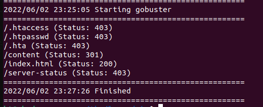
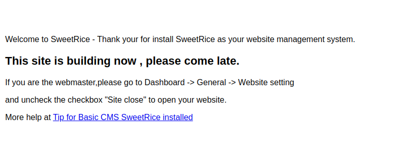
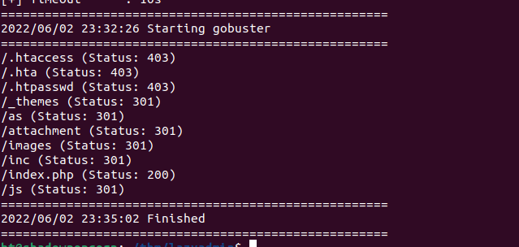
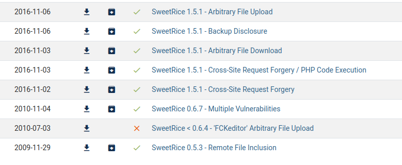
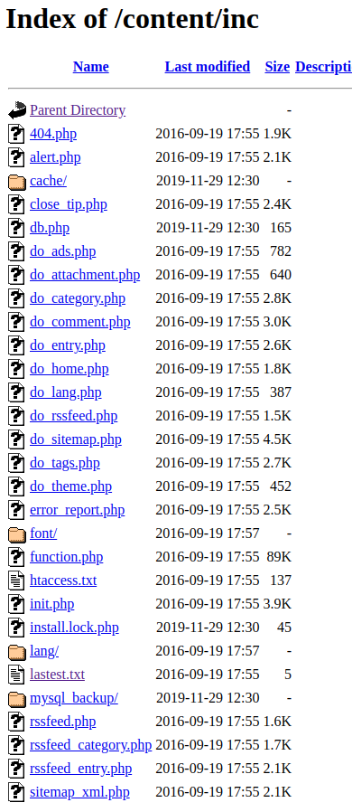
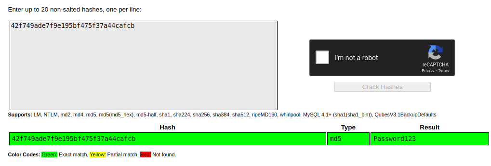
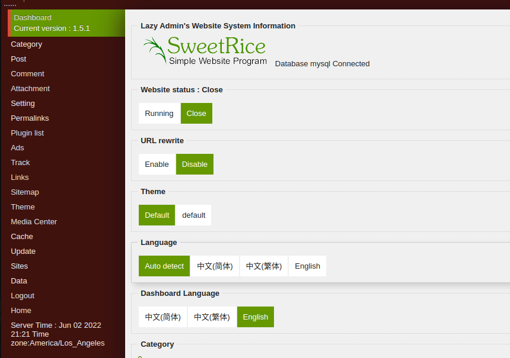

# LazyAdmin
starting off with a quick nmap of the box to get a lay of the land

```
nmap -sV -sC 10.10.31.197 -oN nmap.txt
```
nmap show that the following ports are open 

- 22 - OpenSSH 7.2p2 Ubuntu 4ubuntu2.8
- 80 - Apache httpd 2.4.18

Next I kick off gobusters with the common web content list from seclists

```
gobuster -u 10.10.31.197 -w ~/tools/SecLists/Discovery/Web-Content/common.txt
```


Checking out the /content directory on the webserver we are greated with a site that is running SweetRice CMS



I kick off another gobuster scan this time of the /content directory and get the following results



while that was running I did some searching for sweetrice cms and see a slew of exploits on exploitdb



going back to my gobuster results a few things jump out at me the /attachments dir, the /as dir and the /inc dir
- /attachments dir yeilded an empty directory. 
- /as gives me a login page (bingo found the admin portal)
- /inc dir how ever gives me a nice list of things to explore.



looking at latest.txt gives me a version number

```
1.5.1
```

We also see a folder called mysql_backup lets check that out while we are here
inside of there we see and sql command file
```
mysql_bakup_20191129023059-1.5.1.sql	
```
Lets downlaod that and store it in our working dir for this box just in case it is useful later on

Perfect now we can start looking at exploits for 1.5.1 to see which may get us access to the sever.

Looking at the code forthe Arbitary file upload it looks like we need a username and password which we currently don't have. Lets take a look at the sqlbackup to see if it has any credentails in it we can use.
From the sql back up we can see a possilbe username of manager
we also have a hashed version of the password (appears to be md5)
```
42f749ade7f9e195bf475f37a44cafcb
```
Doing a search for the hash on crackstation.net reveals the password matching this hash



Using the username and passwrod we uncovers we gain access to the admin portal

