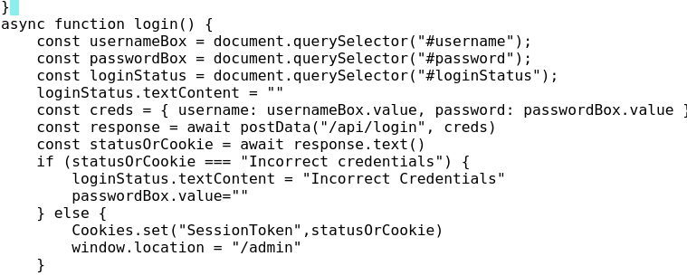
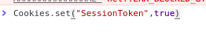
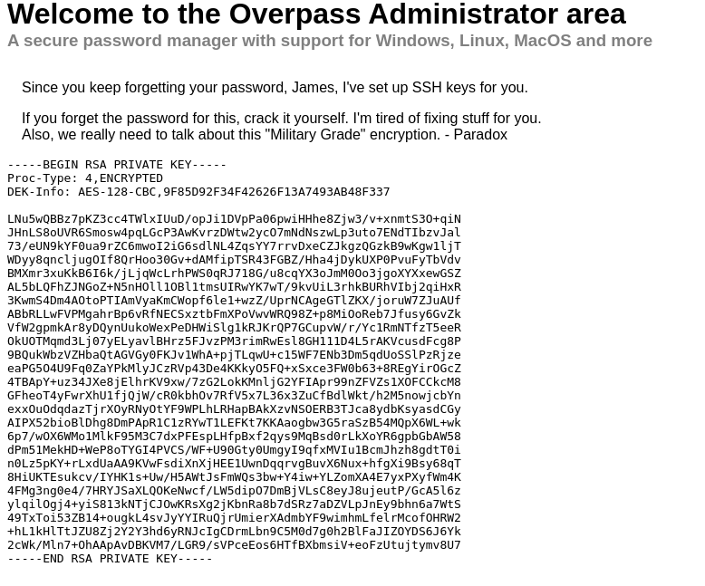

# Overpass

- nmap scan shows only port 80 and 22(ssh) are open
- using ffuf or gobuster you find a hidden admin portal on the web server at http://IP/admin
- looking at the login.js script you see that when you enter a correct username and password a cookie is set with the name SessionToken


- with this knowlege we can set our own cookie with the name SessionToken and set the value to true
- I did this with the chrome developer console



upon refresing the page you are greated with an rsa private key and a message




using ssh2john I converted the sshkey to a john hash format 
then using john and the following command I cracked the password
```
john --wordlist rockyou.txt id_rsa.hash --format=ssh
```


password:james13

